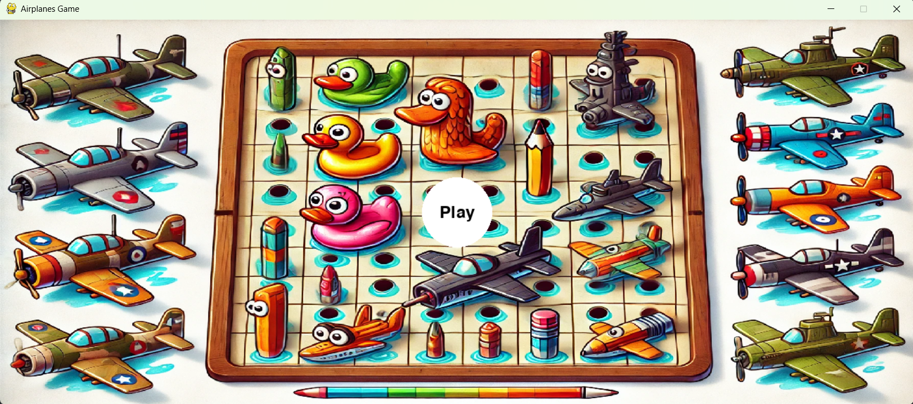
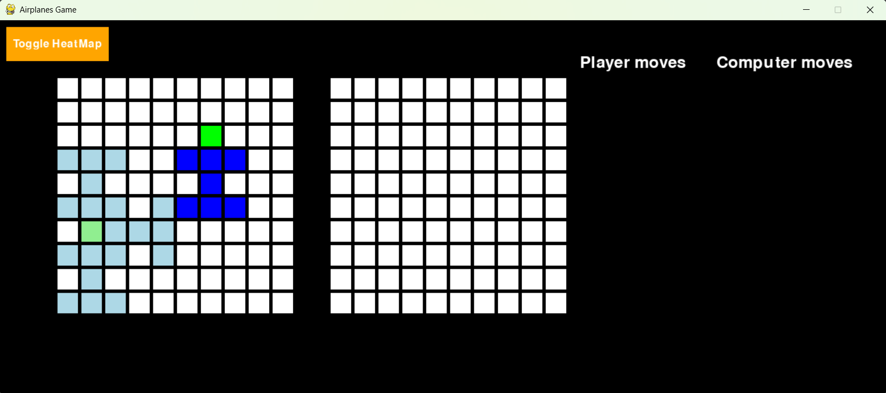
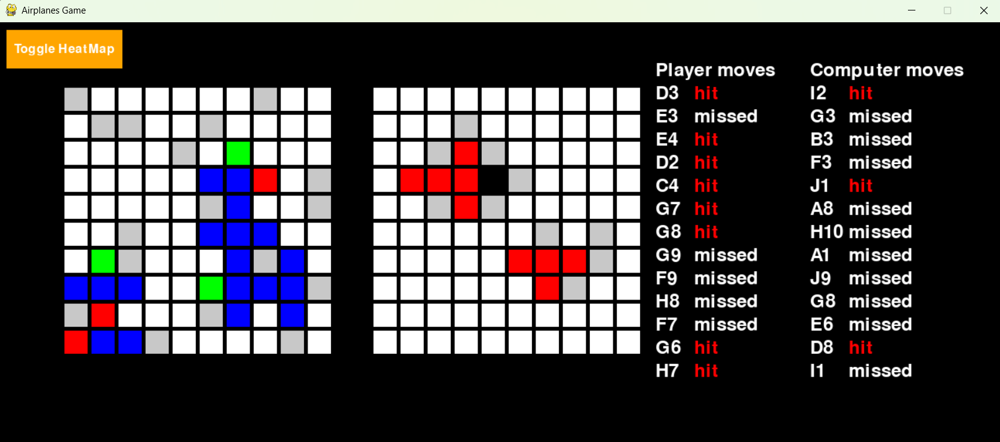
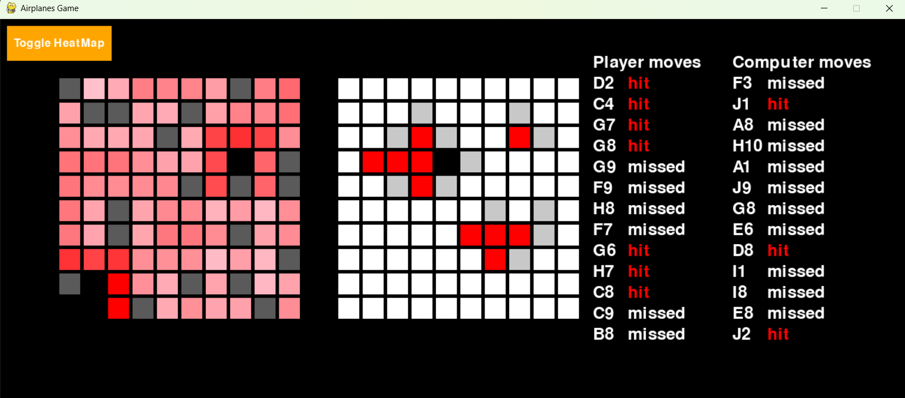

# Airplanes Game

Welcome to the Airplanes Game! This is a strategic board game where you place your airplanes, attack the computer, and try to outsmart its AI strategies. Below you'll find an overview of the game's features, gameplay instructions, and visual walkthroughs using representative screenshots.

## Table of Contents
- [Screenshots](#screenshots)
- [Core Functionalities](#core-functionalities)
- [How to Play](#how-to-play)
- [Computer Strategies](#computer-strategies)
- [Move Logs](#move-logs)

---

## Screenshots

### 1. Welcome Page

### 2. Select Your Airplanes

### 3. Attack and Logs

### 4. Computer's Heat Map

---

## Core Functionalities

- **Select the Position of Your Planes:**
	- At the start, you choose where to place your airplanes on the board. Strategic placement is key to defending against the computer's attacks.

- **Attack the Computer:**
	- Take turns attacking the computer's board, trying to locate and destroy its airplanes before it finds yours.

- **Move Logs:**
	- Every move is logged, allowing you to review your actions and the computer's responses. This helps you analyze strategies and improve your gameplay.

- **Computer Strategies:**
	- The computer uses two main strategies:
		1. **Seek and Destroy:** The computer targets areas where it suspects your planes are located, focusing its attacks for maximum efficiency.
		2. **Heatmap Guessing:** The computer analyzes previous moves and uses a heatmap to guess the most likely positions of your planes, adapting its strategy as the game progresses.

---

## How to Play

1. **Start the Game:**
	 - Launch the game and view the welcome page.
2. **Place Your Airplanes:**
	 - Select positions for your airplanes on your board.
3. **Begin Attacking:**
	 - Take turns attacking the computer's board. Use logic and deduction to find the computer's planes.
4. **Review Move Logs:**
	 - Check the logs to see your moves and the computer's responses.
5. **Win the Game:**
	 - Destroy all of the computer's airplanes before it finds yours!

---

## Computer Strategies

- **Seek and Destroy:**
	- The computer focuses on areas where it has previously hit parts of your airplanes, trying to finish them off quickly.
- **Heatmap Guessing:**
	- The computer uses a heatmap to predict where your airplanes are most likely placed, making its attacks more intelligent over time.

---

## Move Logs

- Every move (attack, hit, miss) is recorded in the move log.
- Use the logs to analyze your gameplay and learn from each match.

---

Enjoy playing Airplanes Game and challenge yourself against a smart computer opponent!
